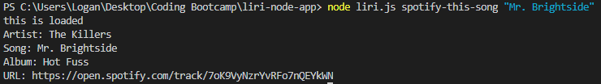
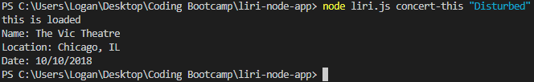
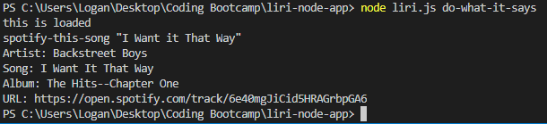
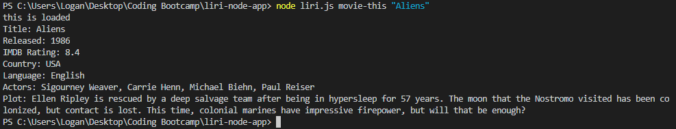

# liri-node-app
like siri but liri

This project is a CLI app that is designed to take in a method and an input, it will perform the method on said input. The methods are spotify-this-song, concert-this, movie-this, and do-what-it-says. It uses the spotify api to search the song and display the artist, song, album, and a link to the song. The BandsInTown api is used to search the band and display the next venue name, location, and date. With the OMDB api it will search the movie given and display the title, release year, rating, country, language, actors, and plot. 

I made this project to test the use of node, cli, and apis. It is an entertaining app that has multiple functionalities of searching for information. 

In order to clone this project and have it work, you will need to make your own .env file that includes your spotify ID and spotify secret for the spotify api.
It should look like this 
```
# Spotify API keys

SPOTIFY_ID=your-spotify-id
SPOTIFY_SECRET=your-spotify-secret
```

How to use:
1. Enter 'node liri.js method "input"' into the CLI, where method is spotify-this-song, concert-this, movie-this, or do-what-it-says.

2. Then your result is passed back to you in the console!

Should look like 
or

or

OR

